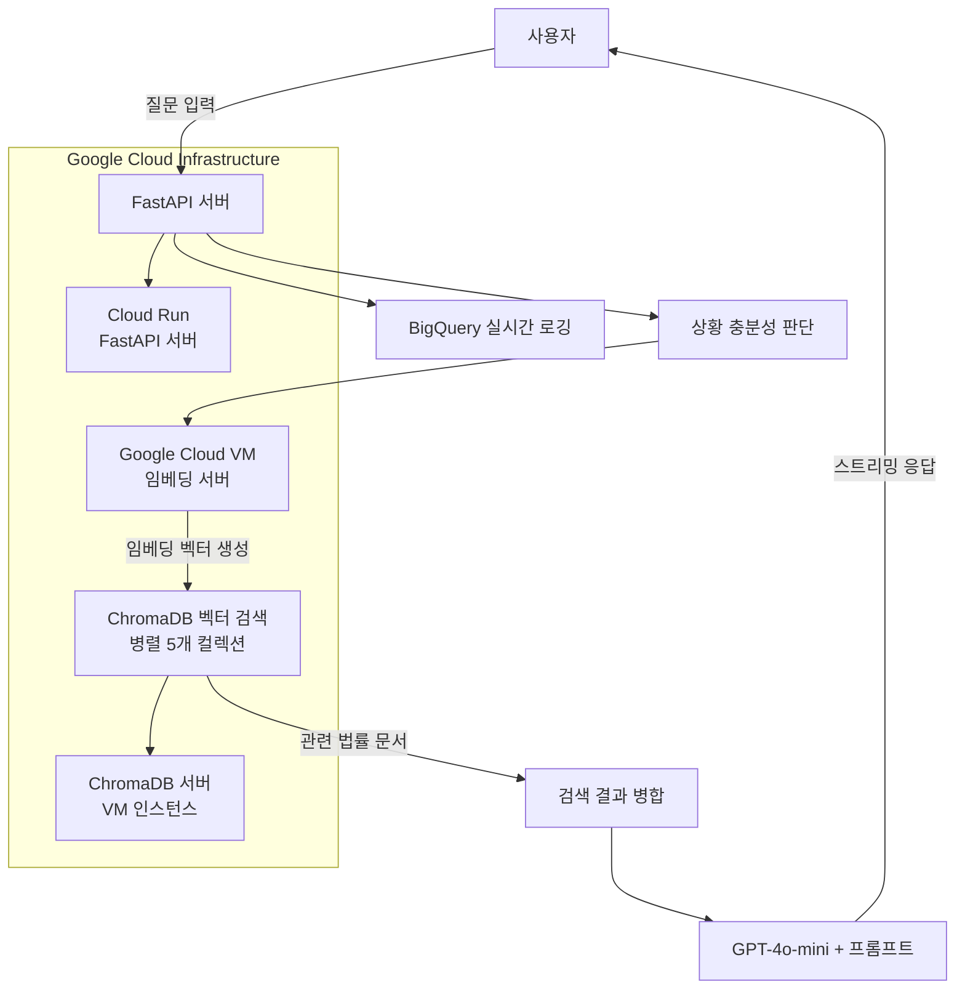

# LAWKEEPER - AI 법률 상담 시스템

<hr>
<p style="text-align: center;">
    <a href="https://github.com/donghyun0518/lawkeepr-rag-ai-chatbot-project/blob/main/lawkeeper.pdf" target="_blank">
        
    </a>
</p>

[프로젝트 발표 자료](https://github.com/donghyun0518/lawkeepr-rag-ai-chatbot-project/blob/main/lawkeeper.pdf)

> 전문 변호사 수준의 신뢰할 수 있는 AI 법률 상담 서비스

🔗 **Live Demo**: [https://lawkeeper.net/](https://lawkeeper.net/)

## 📋 프로젝트 개요

LAWKEEPER는 RAG(Retrieval-Augmented Generation) 기술을 활용하여 누구나 쉽게 법률 상담을 받을 수 있도록 개발된 AI 법률 상담 시스템입니다. 일반적인 LLM 모델에 한국 법률 전문 데이터를 결합하여 신뢰할 수 있는 법률 상담 서비스를 제공합니다.

### 🎯 프로젝트 목표
- 법률적 문제나 궁금증이 있을 때 누구나 쉽게 접근 가능한 AI 상담 서비스
- 전문 변호사 수준의 신뢰할 수 있는 법률 정보 제공  
- RAG 기술을 통한 정확하고 근거 있는 법률 상담 구현

## 🏗️ 시스템 아키텍처



### 상세 처리 흐름
1. **질문 수신**: 사용자가 FastAPI 서버로 질문 전송
2. **충분성 판단**: ChatService에서 상담 가능 여부 자동 판단
3. **임베딩 처리**: Google Cloud VM의 `jhgan/ko-sbert-nli` 서버로 텍스트 전송
4. **벡터 변환**: 임베딩 서버에서 질문을 768차원 벡터로 변환 후 반환
5. **병렬 검색**: ChromaDB 5개 컬렉션에서 코사인 유사도 기반 동시 검색
6. **결과 병합**: 검색된 법률 문서들을 관련도 순으로 정렬 및 병합
7. **AI 상담**: 검색 결과 + 전문 프롬프트로 GPT-4o-mini 호출
8. **스트리밍 응답**: 실시간 청크 단위로 사용자에게 법률 조언 전송
9. **로깅**: 전체 상담 과정을 BigQuery 5개 테이블에 자동 기록

## 📊 데이터셋 구성

### 법률 데이터 소스
| 컬렉션명 | 데이터 유형 | 포맷 | 설명 |
|---------|------------|------|------|
| `legal_rag_docs_kosbert` | 판례 문서 | JSON | AI Hub 법률-규정 텍스트 분석 데이터_고도화_상황에 따른 판례 데이터 (청크 400, 오버랩 100) |
| `legal_qa_rag_docs` | Q&A 상담 | CSV→JSON | 크롤링 기반 법률 상담 사례 |
| `legal_cases` | 대법원 판례 | JSON | AI Hub 법률/규정 (판결서, 약관 등) 텍스트 분석 데이터 |
| `legal_laws` | 법령 조문 | PDF→JSON | 대학교 법학과 법전 데이터 |
| `terms_clauses` | 약관 조항 | JSON | AI Hub 법률/규정 (판결서, 약관 등) 텍스트 분석 데이터 |

### 데이터 전처리 파이프라인
```python
# JSON 데이터 (판례, 약관)
def process_json_data():
    # 1. 원본 JSON 파일 로드
    # 2. 판결문을 본문으로, 기타 정보를 메타데이터로 분리
    # 3. 조문·판례·약관 단위로 개별 JSON 파일 저장

# CSV 데이터 (Q&A)  
def process_csv_data():
    # 1. 원본 CSV 파일 로드
    # 2. 질문 & 답변을 본문으로 분리
    # 3. 각 행의 데이터를 개별 JSON 파일로 저장

# PDF 데이터 (법령, 조문)
def process_pdf_data():
    # 1. 원본 PDF 파일 로드
    # 2. 글꼴과 글자 크기를 활용한 조문 텍스트 추출
    # 3. 조문 내용은 본문으로, 기타 정보는 메타데이터로 분리
    # 4. 법령별 개별 JSON 파일로 저장
```

## 🔍 RAG 기반 검색 시스템

### 임베딩 최적화
- **모델**: `jhgan/ko-sbert-nli` (한국어 법률 도메인 최적화)
- **청킹 전략**: 
  - 판례문: 청크 400자 + 오버랩 100자
  - Q&A, 약관, 법전: 전문 처리 (청크 없음)
- **저장소**: ChromaDB (5개 컬렉션 병렬 검색)

### 병렬 검색 최적화
```python
# 병렬 검색 시스템 (ThreadPoolExecutor 활용)
def search_documents(self, query_embedding, max_docs=5):
    futures = []
    for collection in self.collections:
        future = self.executor.submit(
            self.search_single_collection,
            collection, query_embedding, max_docs
        )
        futures.append(future)
    
    # 모든 컬렉션에서 동시 검색 후 결과 병합
    return merge_search_results(futures)
```

### 컨텍스트 관리
- **후속 질문 처리**: 이전 상황 + 새 질문 결합 검색
- **대화 히스토리 요약**: 최근 10개 메시지 기반 컨텍스트 유지
- **세션 관리**: 상담별 독립적인 컨텍스트 유지

## 🤖 고도화된 프롬프트 시스템

### 초기 자문 프롬프트
```python
# 구조화된 8단계 법률 상담 형식
1. 상황 정리 → 2. 법적 판단 → 3. 판례 적용 → 4. 실무적 조언 
→ 5. 현실적 선택지 → 6. 즉시 실행 가능한 조치 → 7. 주의사항 → 8. 상담 정리
```

### 상황 충분성 판단
```python
def is_description_sufficient(self, context: str) -> str:
    # 1. 빠른 휴리스틱 판단 (단어 수, 법률 키워드, 부정 단서)
    # 2. 캐시 확인으로 성능 최적화
    # 3. GPT-4o-mini 기반 동적 판단
    # 4. 자연스러운 추가 질문 생성
```

### 후속 질문 처리
- **컨텍스트 연결**: 이전 상담 내용과 일관성 있는 조언
- **유연한 구조**: 고정된 형식 없이 자연스러운 대화
- **실시간 히스토리 요약**: 상담 진행에 따른 동적 컨텍스트 업데이트

## 💻 기술 스택

### Backend
- **Python 3.11**: 메인 개발 언어
- **FastAPI**: 고성능 비동기 웹 프레임워크
- **ChromaDB 1.0.6**: 벡터 데이터베이스
- **OpenAI GPT-4o-mini**: 대화형 AI 모델
- **Google BigQuery**: 실시간 로깅 및 분석

### AI/ML
- **임베딩**: `jhgan/ko-sbert-nli` (한국어 특화)
- **RAG**: Retrieval-Augmented Generation
- **NLP**: sentence-transformers 2.6.1

### Infrastructure
- **Google Cloud Run**: 서버리스 배포
- **Google Compute Engine**: ChromaDB 및 임베딩 서버
- **Docker**: 컨테이너 기반 배포

## 📁 프로젝트 구조

```
lawkeeper/
├── main.py                 # FastAPI 메인 애플리케이션
├── requirements.txt        # Python 의존성
├── Dockerfile             # Docker 설정
├── .dockerignore          # Docker 무시 파일
├── .env                   # 환경 변수 (시크릿)
├── static/                # CSS, JS 정적 파일
└── templates/
    └── index.html         # 메인 웹 인터페이스
```

### 핵심 클래스 구조
```python
# main.py의 주요 클래스들
├── DirectBigQueryLogger    # BigQuery 실시간 로깅
├── ResponseCache          # 응답 캐싱 시스템
├── EmbeddingCache         # 임베딩 결과 캐싱
├── EmbeddingService       # 임베딩 API 서비스
├── ChromaDBService        # 벡터 DB 검색 서비스
└── ChatService           # 상담 로직 통합 관리
```

## ☁️ Google Cloud 배포

LAWKEEPER는 Google Cloud 인프라를 활용하여 배포됩니다:

- **ChromaDB 서버**: Compute Engine VM에서 벡터 데이터베이스 운영
- **임베딩 서버**: 별도 VM에서 `jhgan/ko-sbert-nli` 임베딩 모델 서비스 
- **메인 애플리케이션**: Cloud Run에서 FastAPI 서버 운영
- **로깅**: BigQuery를 통한 실시간 상담 데이터 수집 및 분석

Docker 컨테이너 기반으로 패키징되며, Cloud Build를 통해 자동 배포 파이프라인이 구축되어 있습니다.

## 📈 모니터링 및 로깅

### BigQuery 통합 로깅
```python
# 5개 테이블에 자동 로깅
├── chat_interactions     # 모든 상담 내용 및 응답
├── chat_analytics       # 상담 통계 및 성능 분석  
├── error_logs          # 시스템 에러 및 예외
├── performance_metrics # API 응답시간, 처리속도
└── system_health      # 서비스 상태 및 헬스체크
```

### 실시간 모니터링 지표
- **응답 시간**: 임베딩, 검색, GPT 처리 시간 분리 측정
- **검색 정확도**: 관련 문서 반환 개수 및 품질
- **사용자 만족도**: 상담 후 피드백 수집
- **시스템 안정성**: 헬스체크 및 에러율 추적

### 성능 최적화 기능
```python
# 다층 캐싱 시스템
├── ResponseCache        # 동일 질문 빠른 응답 (200개 LRU)
├── EmbeddingCache      # 임베딩 결과 캐시 (100개 LRU) 
└── 24시간 TTL 설정     # 자동 캐시 무효화
```

## 🔧 주요 기능

### 🎯 10단계 상담 프로세스
1. **상황 입력** → 사용자 법률 상황 설명
2. **충분성 판단** → AI가 상담 가능 여부 자동 판단  
3. **상황 요약 & 임베딩** → 검색 최적화를 위한 컨텍스트 정제
4. **상황 RAG 검색** → 관련 법률 문서 병렬 검색
5. **응답 생성 & BigQuery 기록** → 전문 법률 조언 제공
6. **후속 질문** → 추가 궁금증 해결
7. **상황 + 질문 요약 & 임베딩** → 컨텍스트 확장 검색  
8. **상황 + 질문 RAG 검색** → 추가 법률 자료 검색
9. **대화 히스토리 요약** → 연속성 있는 상담 지원
10. **응답 생성 & BigQuery 기록** → 맞춤형 후속 조언

### 🤖 스마트 상담 기능
- **상황 충분성 자동 판단**: 30개 법률 키워드 기반 + GPT 동적 판단
- **병렬 벡터 검색**: 5개 컬렉션 동시 검색으로 성능 최적화
- **실시간 스트리밍**: 청크 단위 응답으로 자연스러운 대화
- **컨텍스트 유지**: 대화 히스토리 요약으로 연속 상담 지원

## 🖥️ 웹 인터페이스

### PC/Mobile 반응형 디자인
- **개인정보 보호**: 수집 동의 및 투명한 정책 제공
- **직관적 UI**: 법률 상담에 최적화된 채팅 인터페이스  
- **실시간 피드백**: 관련 문서 개수 표시로 답변 신뢰도 향상
- **접근성**: 배경 테마, 글씨 크기 사용자 설정
- **세션 관리**: 새로운 상담용 리셋 기능

### 사용자 경험 최적화
- **스트리밍 응답**: 타이핑 효과로 자연스러운 대화감
- **에러 핸들링**: 서비스 장애 시 명확한 안내 메시지
- **상담 가이드**: 초기 안내사항 및 법적 면책 고지

## ⚙️ 핵심 클래스 상세

### `DirectBigQueryLogger`
- **실시간 로깅**: 모든 상담 내용을 BigQuery 5개 테이블에 자동 기록
- **성능 추적**: API 처리시간, 검색속도, 응답품질 메트릭 수집
- **익명화 처리**: 세션 ID 해시화로 개인정보 보호

### `ChromaDBService`  
- **병렬 검색**: ThreadPoolExecutor로 5개 컬렉션 동시 검색
- **자동 복구**: 컬렉션 로드 실패 시 우선순위 기반 재시도
- **헬스체크**: 주기적 연결 상태 확인 및 복구

### `ChatService`
- **세션 상태 관리**: initial_mode, case_context, history 추적
- **지능형 판단**: 상황 설명 충분성 자동 평가 
- **컨텍스트 최적화**: 대화 히스토리 요약으로 토큰 효율성

### `EmbeddingService`
- **캐시 최적화**: 동일 텍스트 재임베딩 방지
- **외부 API 연동**: VM 기반 임베딩 서버와 HTTP 통신
- **에러 복구**: 타임아웃 및 연결 실패 대응

## 🛠️ API 엔드포인트

### 메인 API
```python
POST /api/chat              # 스트리밍 채팅 API
POST /api/reset            # 세션 초기화  
GET  /health              # 시스템 상태 확인
GET  /test-bigquery       # BigQuery 연동 테스트
GET  /                    # 메인 웹 인터페이스
```

### 스트리밍 응답 형식
```json
// 청크 단위 응답
{"chunk": "안녕하세요", "session_id": "user123"}

// 최종 완료 응답  
{"response": "전체응답", "session_id": "user123", "done": true}
```

## 🔒 보안 및 개인정보 보호

### 데이터 보호
- **익명화 처리**: 세션 ID SHA256 해시화 (8자리)
- **최소 수집**: 법률 상담에 필수적인 정보만 수집
- **투명성**: 개인정보 처리방침 명시
- **법적 면책**: 상담 전 명확한 책임 한계 고지

### 시스템 보안
- **환경변수 관리**: API 키 등 민감정보 분리
- **HTTPS 강제**: 모든 통신 암호화
- **CORS 설정**: 안전한 크로스 오리진 요청
- **헬스체크**: 주기적 시스템 상태 모니터링

## 🧪 품질 관리

### 서비스 안정성
- **에러 핸들링**: 모든 예외 상황에 대한 사용자 친화적 안내
- **타임아웃 관리**: OpenAI API, ChromaDB 검색 타임아웃 설정
- **캐시 무효화**: 24시간 TTL로 최신 정보 보장
- **성능 모니터링**: 실시간 응답속도 및 정확도 추적

### 품질 검증
- **헬스체크**: `/health` 엔드포인트를 통한 시스템 상태 확인
- **BigQuery 연동 테스트**: `/test-bigquery` 엔드포인트로 로깅 시스템 검증
- **실시간 로깅**: 모든 상담 과정의 성능 지표 자동 수집

## 🔄 실제 활용 확장 사례

### 1. 주소 데이터 품질 관리
- RAG 검색을 통한 고객 주소 자동 정제 및 표준화
- 잘못된 주소 입력 시 올바른 주소 제안
- 주소 변경 이력 추적 및 업데이트

### 2. 자동 리포트 생성
- RAG 기반 법률 문서 분석 및 요약
- 고객 맞춤형 법률 리포트 자동 작성
- 데이터 기반 법률 인사이트 제공

## 👥 개발팀

- **서동현** - Backend Development & RAG System Architecture
- **유동현** - Frontend Development & UI/UX Design  
- **김준희** - Data Collection & Legal Database Construction
- **노승욱** - Cloud Infrastructure & DevOps

---

⚠️ **법적 고지사항**: 본 서비스는 법률 정보 제공을 목적으로 하며, 전문적인 법률 자문을 대체하지 않습니다. 중요한 법적 문제의 경우 반드시 전문 변호사와 상담하시기 바랍니다.
